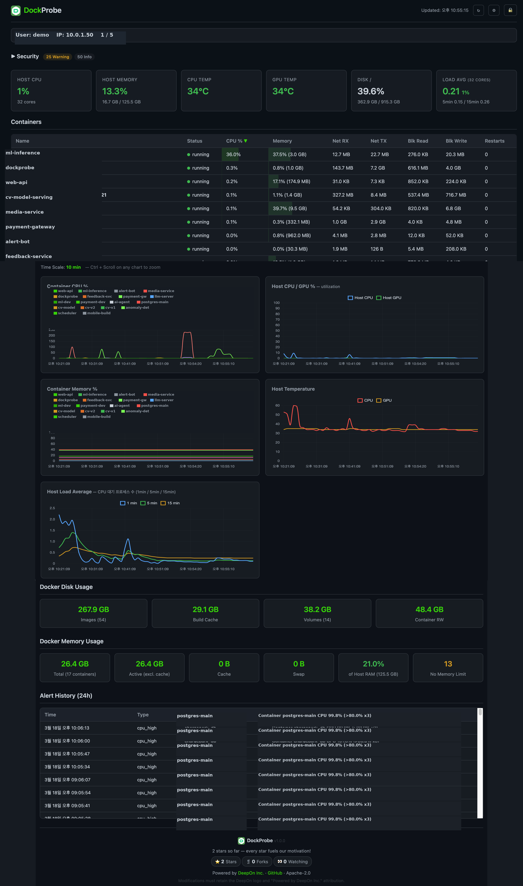

<p align="center">
  
</p>

<h1 align="center">DockProbe</h1>

<p align="center">
  <b>Lightweight Docker monitoring dashboard with anomaly detection & Telegram alerts.</b><br>
  One container. One command. Full visibility.
</p>

<p align="center">
  <b>English</b> | <a href="README.ko.md">한국어</a> | <a href="README.ja.md">日本語</a> | <a href="README.de.md">Deutsch</a> | <a href="README.fr.md">Français</a> | <a href="README.es.md">Español</a> | <a href="README.pt.md">Português</a> | <a href="README.it.md">Italiano</a>
</p>

<p align="center">
  
  
  
  
</p>

<p align="center">
  <a href="https://www.youtube.com/shorts/SqKSEtiyYzM">▶ Watch 60-second demo on YouTube</a>
</p>

---

## What is DockProbe?

DockProbe is a self-hosted Docker monitoring dashboard that runs as a single container. It collects real-time CPU, memory, network, and disk metrics from all your containers and the host machine — then displays everything in a clean, dark-themed web UI.

**GPU-aware host monitoring** tracks NVIDIA GPU temperature and utilization alongside CPU usage, host memory, disk pressure, and load average — all in real-time charts. If you run ML workloads or GPU-intensive containers, DockProbe gives you full visibility without installing separate GPU monitoring tools.

When something goes wrong, DockProbe detects it automatically. Six built-in anomaly detection rules watch for CPU spikes, memory overflows, temperature warnings, disk pressure, unexpected restarts, and network surges. Each alert includes **recommended actions with ready-to-run commands** — so you know exactly what to do, not just what went wrong. Alerts are sent instantly to Telegram so you can respond before users notice.

A built-in security scanner runs 16 automated checks every 5 minutes — covering container misconfigurations, network exposure, and host-level hardening — so you can spot vulnerabilities before they become incidents.

There's no agent to install on each container, no external database, no complex configuration. Just mount the Docker socket, run one command, and you have full visibility into your Docker environment at `https://localhost:9090`. Need access from outside your network? Built-in Cloudflare Tunnel support gives you secure public HTTPS with zero port-forwarding.

---

## Quick Start

```bash
git clone https://github.com/deep-on/dockprobe.git && cd dockprobe && bash install.sh
```

That's it. The interactive installer sets up authentication, Telegram alerts, and HTTPS — then opens `https://localhost:9090`.

> **Requirements:** Docker (with Compose v2), Git, OpenSSL

---

## Dashboard Preview

<p align="center">
  
</p>

---

## Features

| Category | What you get |
|----------|-------------|
| **Real-time Dashboard** | Dark-themed web UI, 10s auto-refresh, sortable tables, Chart.js charts |
| **Container Monitoring** | CPU %, memory %, network I/O, block I/O, restart count |
| **Host Monitoring** | CPU/GPU temperature & utilization, memory usage, disk usage, load average |
| **Anomaly Detection** | 6 rules with recommended actions — CPU spike, memory overflow, high temp, disk full, restart, network spike |
| **Telegram Alerts** | Instant notification with 30-min cooldown per alert type |
| **Security** | Basic Auth, rate limiting (5 fails = 60s lockout), HTTPS |
| **Security Scanner** | 16 automated checks (container/host/network), 5-min scan cycle, severity badges |
| **Session Management** | Active connection tracking, configurable max connections, live IP display |
| **Password Management** | Change username/password via dashboard UI |
| **Settings UI** | Adjust max connections at runtime from the dashboard |
| **Access Modes** | Self-signed SSL (default) or Cloudflare Tunnel (no port-forwarding) |
| **Lightweight** | 4 Python packages, single HTML file, SQLite with 7-day retention |

---

## Dashboard

| Section | Details |
|---------|---------|
| Session Bar | Logged-in user, IP, active connections / max limit |
| Host Cards | CPU temp, GPU temp, CPU/GPU %, host memory, disk %, load average |
| Container Table | Sortable by CPU/memory/network, color-coded anomalies |
| Charts (5) | Container CPU & memory trends, host CPU/GPU %, host temperature & load |
| Docker Disk | Images, build cache, volumes, container RW layers |
| Alert History | Last 24h with timestamps |

---

## Anomaly Detection Rules

| Rule | Condition | Action |
|------|-----------|--------|
| Container CPU | >80% for 3 consecutive checks (30s) | Telegram + red highlight |
| Container Memory | >90% of limit | Immediate alert |
| Host CPU Temp | >85°C | Immediate alert |
| Host Disk | >90% usage | Immediate alert |
| Container Restart | restart_count increased | Immediate alert |
| Network Spike | RX 10x surge + >100MB | Immediate alert |

All thresholds are configurable via environment variables.

Each anomaly includes **actionable recommendations** with specific commands:

| Anomaly | Example Recommendation |
|---------|----------------------|
| CPU spike | `docker stats <name>` · `docker restart <name>` · `docker update --cpus=2 <name>` |
| Memory overflow | `docker stats <name>` · `docker update --memory=2g <name>` |
| Restart loop | `docker logs --tail 50 <name>` · `docker inspect <name>` |
| Network spike | `docker logs --tail 50 <name>` · Check for DDoS or unexpected traffic |
| High temperature | Check fan/cooling system · `sensors -u` for details |
| Disk full | `docker system prune -f` · `docker builder prune -f` · `docker volume prune` |

---

## Security Scanner

DockProbe runs 16 automated security checks every 5 minutes and displays results in a dedicated dashboard section with severity badges.

| Category | Checks |
|----------|--------|
| **Container** (9) | Privileged mode, running as root, dangerous capabilities, Docker socket mount, sensitive path mounts, read-only rootfs, AppArmor/Seccomp disabled, secrets in env vars, no memory/CPU limits |
| **Network** (3) | Host network mode, excessive port exposure, SSH port (22) exposure |
| **Host** (4) | Docker daemon security options, kernel ASLR, IP forwarding, Linux Security Module status |

**Severity levels:**
- 🔴 **Critical** — Immediate action required (e.g., privileged mode, writable Docker socket)
- 🟡 **Warning** — Security improvement recommended
- 🔵 **Info** — Informational findings
- 🟣 **Unavailable** — Check cannot run due to environment constraints; shows how to enable it

> Host-level checks require volume mounts (`/proc:/host_proc:ro`, `/sys:/host_sys:ro`). If not mounted, those checks show as **Unavailable** with setup instructions.

> Interested in hardening your SSH server? Check out [ssh-audit-kit](https://github.com/deep-on/ssh-audit-kit) — SSH security audit, hardening, and reporting in a single shell script.

---

## Architecture

```
┌──────────────────────────────────────────────┐
│  DockProbe Container                         │
│                                              │
│  FastAPI + uvicorn (port 9090)               │
│  ├── collectors/                             │
│  │   ├── containers.py  (aiodocker)          │
│  │   ├── host.py        (/proc, /sys, GPU)   │
│  │   └── images.py      (system df)          │
│  ├── alerting/                               │
│  │   ├── detector.py    (6 rules + actions)  │
│  │   └── telegram.py    (httpx)              │
│  ├── security/                               │
│  │   └── scanner.py     (16 checks)          │
│  ├── storage/                                │
│  │   └── db.py          (SQLite WAL)         │
│  └── static/                                 │
│      └── index.html     (Chart.js)           │
│                                              │
│  Volumes:                                    │
│    docker.sock (ro), /sys (ro), /proc (ro),  │
│    nvidia-smi (ro), SQLite named volume      │
└──────────────────────────────────────────────┘
```

**Dependencies (4 packages only):**
- `fastapi` — Web framework
- `uvicorn` — ASGI server
- `aiodocker` — Async Docker API client
- `httpx` — Async HTTP client (Telegram API)

---

## Configuration

All settings via `.env` file:

```env
# Authentication (required)
AUTH_USER=admin
AUTH_PASS=your-password

# Telegram alerts (optional)
TELEGRAM_BOT_TOKEN=your-bot-token
TELEGRAM_CHAT_ID=your-chat-id

# Thresholds (optional, shown with defaults)
CPU_THRESHOLD=80
MEM_THRESHOLD=90

# Connection limit (optional, 0 = unlimited)
MAX_CONNECTIONS=3

# Cloudflare Tunnel (optional)
CF_TUNNEL_TOKEN=your-tunnel-token
```

---

## Access Modes

### Option 1: Local Network (self-signed SSL) — default

```bash
bash install.sh   # choose option 1
```

Access via `https://localhost:9090` or `https://<your-ip>:9090`

To access from other devices on the same network, use the server's LAN IP (e.g. `https://192.168.1.100:9090`). You may need to:
- Allow port 9090 in the firewall: `sudo ufw allow 9090/tcp`
- Accept the self-signed certificate warning in your browser

> **Why the browser warning?** DockProbe uses a self-signed SSL certificate generated during installation. Since it's not issued by a trusted Certificate Authority (CA), browsers show a "Your connection is not private" warning. This is normal and expected — click "Advanced" → "Proceed to site" to continue. To eliminate this warning, use Cloudflare Tunnel (Option 3) which provides a trusted TLS certificate automatically.

### Option 2: Remote Access via Port Forwarding

If you want to access DockProbe from outside your local network without Cloudflare:

1. Forward port 9090 on your router to the server's LAN IP
2. Access via `https://<your-public-ip>:9090`
3. Use a dynamic DNS service (e.g. No-IP, DuckDNS) if your public IP changes

> **Note:** This exposes the port directly. Basic Auth + HTTPS are enabled by default, but consider using Cloudflare Tunnel (Option 3) for better security.

### Option 3: Cloudflare Tunnel (recommended for remote access)

No port-forwarding, no firewall changes, proper TLS certificate — the easiest way to access DockProbe from anywhere.

```bash
bash install.sh   # choose option 2, paste tunnel token
```

**Setup steps:**
1. Create a free account at [Cloudflare Zero Trust](https://one.dash.cloudflare.com)
2. Go to **Networks** > **Tunnels** > **Create a tunnel**
3. Name your tunnel (e.g. `dockprobe`) and copy the tunnel token
4. Run `bash install.sh` and choose the Cloudflare Tunnel option
5. Paste the token when prompted
6. In the Cloudflare dashboard, add a **Public Hostname** pointing to `http://localhost:9090`
7. Access via `https://your-domain.com` with a valid TLS certificate

---

## API Endpoints

| Endpoint | Method | Description |
|----------|--------|-------------|
| `/` | GET | Dashboard HTML |
| `/api/current` | GET | Latest snapshot (containers + host + images + anomalies) |
| `/api/history/{name}?hours=1` | GET | Container time-series |
| `/api/history/host?hours=1` | GET | Host time-series |
| `/api/alerts?hours=24` | GET | Alert history |
| `/api/session` | GET | Current user, IP, active connections |
| `/api/settings` | GET/POST | Runtime settings (max_connections) |
| `/api/change-password` | POST | Change username/password |
| `/api/health` | GET | Health check (no auth required) |

---

## Security

DockProbe is designed for safe self-hosting with multiple layers of protection:

**Authentication & Access**
- **Basic Auth** on all endpoints (except `/api/health`)
- **PBKDF2-SHA256** password hashing with random salt (600k iterations)
- **Rate limiting** — 5 failed login attempts → 60s lockout per IP
- **Minimum 8-character** password requirement
- **Connection limit** — Configurable max simultaneous users

**Network & Transport**
- **HTTPS** — Self-signed RSA-4096 (default) or Cloudflare Tunnel
- **CORS** — Cross-origin requests explicitly blocked
- **CSRF protection** — POST endpoints require `X-Requested-With` header
- **HTTP fallback warning** — Cleartext mode warns on startup (tunnel-only)

**Container Hardening**
- **Non-root** — Container runs as `appuser`, not root
- **Read-only mounts** — Docker socket, /sys, /proc all mounted read-only
- **Path traversal protection** — Static file serving validates resolved paths
- **No write access** — Monitoring-only, no container control
- **No OpenAPI/Swagger** — API documentation endpoints disabled in production

**Proxy-Aware Rate Limiting**
- `X-Forwarded-For` is only trusted from IPs listed in `TRUSTED_PROXIES` env var
- Direct connections always use the real client IP

---

## Manual Setup

If you prefer manual configuration over the install script:

```bash
git clone https://github.com/deep-on/dockprobe.git
cd dockprobe

# Create .env
cp .env.example .env
vi .env

# Generate SSL cert (optional)
mkdir -p certs
openssl req -x509 -newkey rsa:2048 -nodes \
  -keyout certs/key.pem -out certs/cert.pem \
  -days 365 -subj "/CN=dockprobe"

# Start
docker compose up -d --build
```

---

## License

Apache License 2.0 — see [LICENSE](LICENSE)

**Attribution:** Modified or redistributed versions must retain the DeepOn logo and "Powered by DeepOn Inc." notice in the UI.

---

<p align="center">
  
  Built by <a href="https://deep-on.com">DeepOn Inc.</a>
</p>
